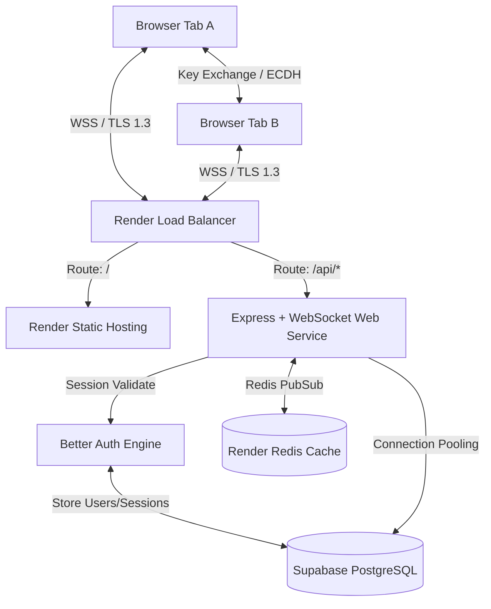

# Production System Architecture & Design Specification
## SyncCanvas Collaborative Whiteboard

This document defines the system architecture, security models, data encryption protocols, safety checks, and real-time optimization strategies required to take the SyncCanvas prototype to a production-grade, highly available, and secure collaborative application.

---

## 1. System Topology



---

## 2. Technology Stack & Hosting Topology

### 2.1 Authentication: Better Auth
- **Setup**: Better Auth runs as a self-hosted API middleware within our Express app on Render, pointing directly to the Supabase database.
- **Session Strategy**: Database-backed sessions for instant revocation capability (essential for multi-user security audits), with client-side session tokens sent via standard HTTP-only, secure, SameSite=Strict cookies to guard against XSS/CSRF.
- **OAuth & Multi-factor**: Integrated Social Logins (Google, GitHub) alongside Time-Based One-Time Password (TOTP) MFA.

### 2.2 Database Layer: Supabase
- **Engine**: Serverless PostgreSQL instance managed via Supabase.
- **Connection Management**:
  - WebSockets make persistent backend connections. The backend instances use Supabase's transaction connection pooler (**Supavisor**) on port `6543` to avoid exhausting maximum database connections during autoscale events.
- **Row-Level Security (RLS)**:
  - Tight RLS policies ensure that users can only read/write whiteboard elements in rooms they belong to.
  ```sql
  -- Example RLS policy for room access control
  CREATE POLICY "Users can only read elements in joined rooms"
    ON public.canvas_elements
    FOR SELECT
    USING (
      exists (
        SELECT 1 FROM public.room_members
        WHERE room_members.room_id = canvas_elements.room_id
          AND room_members.user_id = auth.uid()
      )
    );
  ```

### 2.3 Hosting: Render
- **Frontend**: Render **Static Site** backed by a global CDN, configured with gzip/Brotli pre-compression.
- **Backend API**: Render **Web Service** running Node.js in a Dockerized environment.
  - Scaled horizontally across multiple instances behind Render's native Layer 7 Load Balancer.
  - Health check path configured at `/health` returning `200 OK` under `100ms` only when connection to Supabase and Redis is healthy.
- **State Coordination**: A Render **Redis** instance acting as a Pub/Sub message broker to synchronize canvas operations across multiple autoscale API instances.

---

## 3. User Privacy & Complete Data Encryption

To guarantee complete privacy, security is split into two tiers: **Transport/Server Security** and optional **Zero-Knowledge End-to-End Encryption (E2EE)**.

### 3.1 Encryption-in-Transit
- All connections are strictly encrypted using TLS 1.3.
- HTTP traffic is forced to HTTPS via HTTP Strict Transport Security (`HSTS`).
- WebSocket connections are established solely over Secure WebSockets (`wss://`).

### 3.2 Server-Side Encryption-at-Rest
- Supabase databases are encrypted at rest using AES-256.
- Sensitive user data (emails, profile information, audit logs) is encrypted at the column level using the PostgreSQL `pgcrypto` extension or Supabase Vault, ensuring database admins cannot inspect raw user data.

### 3.3 Zero-Knowledge End-to-End Encryption (E2EE) for Canvas Data
For rooms marked as "Private", whiteboard data (strokes, text, shapes) is encrypted on the client *before* being transmitted to the WebSocket server. The server acts as a blind relay, storing and distributing encrypted byte packages (Ciphertext) without possessing the key.

#### Key Derivation & Handshake
1. When a room is created, the host generates a random 256-bit room key using the Web Crypto API:
   ```javascript
   const roomKey = await window.crypto.subtle.generateKey(
     { name: "AES-GCM", length: 256 },
     true,
     ["encrypt", "decrypt"]
   );
   ```
2. The key is appended to the URL as a hash fragment (e.g., `https://canvas.aaply.app/room/default#key=xyz...`). Hash fragments are never sent to the server by the browser, preserving client-side privacy.
3. Invitees copy the URL. Their browser extracts the key from the hash segment locally.

#### Real-time Payload Encryption Flow
When sending a canvas operation:
1. Serialize the operation JSON (e.g., coordinates, text content).
2. Encrypt using AES-GCM-256 with a cryptographically secure 12-byte Initialization Vector (IV):
   ```javascript
   const iv = window.crypto.getRandomValues(new Uint8Array(12));
   const encodedData = new TextEncoder().encode(JSON.stringify(opData));
   const ciphertext = await window.crypto.subtle.encrypt(
     { name: "AES-GCM", iv: iv },
     roomKey,
     encodedData
   );
   ```
3. Wrap the resulting ciphertext and IV in a base64 envelope and send it via WebSockets.
4. Peers receive the envelope, decrypt the ciphertext using the local key, and render it.

---

## 4. Strict Safety Checks & Handshake Controls

### 4.1 Authenticated WebSocket Handshake
Anonymous WebSocket connections are blocked. The upgrade handshake checks the cookies sent by the browser to validate the session against Better Auth:

```javascript
import { auth } from "./better-auth-config.js";

httpServer.on("upgrade", async (request, socket, head) => {
  // 1. Extract session token from cookie
  const session = await auth.api.getSession({ headers: request.headers });
  
  if (!session) {
    socket.write('HTTP/1.1 401 Unauthorized\r\n\r\n');
    socket.destroy();
    return;
  }
  
  // 2. Attach user profile to request context and proceed
  request.user = session.user;
  wss.handleUpgrade(request, socket, head, (ws) => {
    wss.emit("connection", ws, request);
  });
});
```

### 4.2 Rate Limiting and Payload Sanitization
- **IP Rate Limiting**: Limit HTTP routes to 100 requests per minute and WebSocket upgrades to 10 connections per minute per IP using `express-rate-limit`.
- **WebSocket Message Throttling**: If a client sends more than 50 WebSocket operations per second, they are automatically disconnected to prevent buffer-bloat or script-based spam.
- **Strict Size Limits**: The server rejects messages larger than `128KB` (normal operations are `<2KB`).
- **Input Schema Validation**: All operations are validated at runtime using `Zod` schemas:
  ```javascript
  import { z } from "zod";

  const ElementOpSchema = z.object({
    type: z.enum(["add", "update", "delete"]),
    elementId: z.string().regex(/^elem_[a-zA-Z0-9_]+$/),
    data: z.object({
      type: z.enum(["stroke", "rect", "ellipse", "arrow", "text"]),
      x: z.number(),
      y: z.number(),
      width: z.number().max(10000),
      height: z.number().max(10000),
      props: z.object({
        stroke: z.string().regex(/^#[0-9a-fA-F]{6}$/).optional(),
        strokeWidth: z.number().min(1).max(50).optional(),
        fill: z.string().nullable().optional()
      }).strict()
    }).partial()
  });
```

### 4.3 Content Security Policy (CSP) & Headers
We enforce secure response headers via `helmet.js`:
- `Content-Security-Policy`: Standard restricts script loading to `'self'`, prevents framing (`frame-ancestors 'none'`), and blocks mixed content (HTTP assets over HTTPS).
- `X-Frame-Options: DENY`: Prevents clickjacking.
- `Cross-Origin-Opener-Policy: same-origin`: Insulates user sessions from other origins.

---

## 5. Real-Time Performance & Sync Optimizations

Collaborative drawing requires low-latency updates without overloading backend event loops or client-side frames.

### 5.1 Real-Time Pub/Sub Mesh Scaling
When Render spins up multiple API nodes under load, clients connect to different servers. We route message coordination through Redis Pub/Sub:
1. A client on Node A sends an operation.
2. Node A saves it to Supabase and publishes it to Redis: `redis.publish('room:default', JSON.stringify(msg))`.
3. Node B, which is subscribed to `'room:default'`, receives the payload and broadcasts it to its locally connected room clients.

```
[Client A] -> (Node A) -> [Redis PubSub] -> (Node B) -> [Client B]
```

### 5.2 Transmission Optimizations
- **Adaptive Cursor Throttling**: Cursors throttle dynamic updates to `100ms` (10Hz). If peer counts exceed 15 users in a single room, the rate automatically dials down to `200ms` (5Hz) to preserve client CPU rendering budgets.
- **Delta compression**: For pen stroke additions, the client transmits only newly appended coordinate pairs (deltas) instead of the entire point array.
- **Binary Protocols (MessagePack)**: In high-density environments, switch WebSocket payloads from JSON string formats to **MessagePack** (binary JSON). This reduces payload sizes by ~40% and speeds up browser serialization loops.
- **Permessage-Deflate**: Enable RFC 7692 compression on WebSocket servers. This compresses redundant text blocks (like repeated coordinate sets) by up to 80% at the expense of minor server-side memory overhead.
